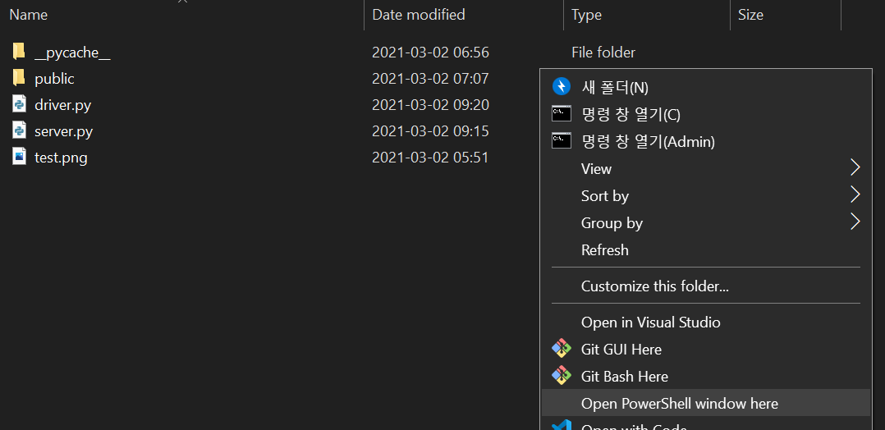
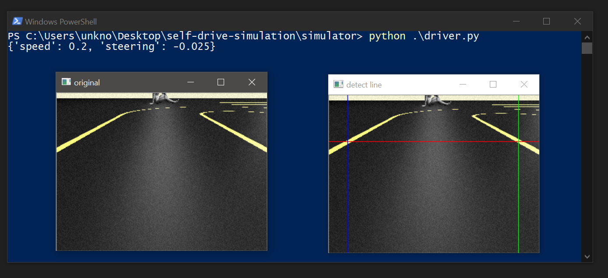
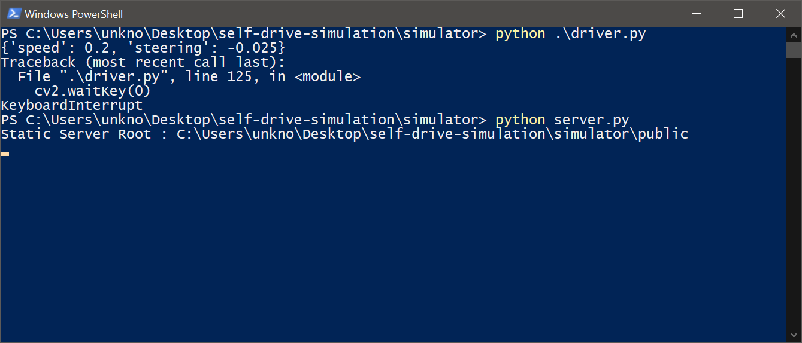
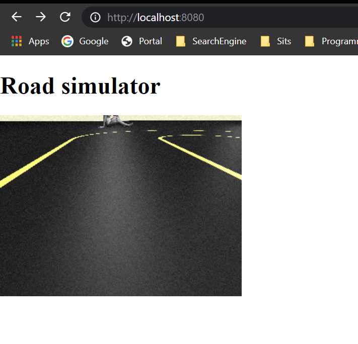

# 자율주행 시뮬레이션 플랫폼

본 프로젝트의 목적은 `WebGL`, `Python`, `OpenCV`를 사용하여 자율주행차량을 시뮬레이션할 수 있는 교육 목적의 시뮬레이터를 만드는 것이다.

## 개발 동기

2021년, 코로나로 인해 동아리에서 실제 하드웨어를 실제로 만들기가 어렵게 되었다. 아무리 간단한 로봇이라도 대략 10시간정도는 들여야 만들 수가 있는데, 코로나로 인하여 동아리방을 사용할 수 없을 뿐만 아니라, 공간을 얻었다 하더라도 5인이상 집합 금지 조치로 로봇을 만들 수가 없다. 이에 따라 100% 온라인으로 교육을 진행할 수 있는 방법을 생각해보았으며 그 결과 자율주행자동차 시뮬레이터를 만들어 부원들을 교육하기로 결정했다.

성능이 어떠할지에 대해서는 걱정이 많았으나, 실제로 만들어본 바 주행 속도를 충분히 느리게 하면 괜찮을 것 같다.

## 프로젝트 설명

본 프로젝트는 자율주행차량을 만드는 방법을 교육할 수 있는 교육용 시뮬레이터이다. 본 프로젝트의 `simulaotr/driver.py` 파일은 시뮬레이션 내부의 자율주행차량에 부착된 카메라로부터 영상 정보를 받아, 차량이 주행해야 할 조향각과 속도를 반환하도록 설계되어있다. 이 `driver.py` 파일에는 매우 단순한 주행 알고리즘이 기본적으로 작성되어있는데, 이것을 수정하여 차량이 정상적으로 경로를 완주할 수 있도록 하는 것이 본 교육의 목적이다.

### 요구사항

본 프로젝트를 구동하기 위해서는 다음과 같은 프로그램들이 설치되어 있어야 한다.
파이썬에 익숙한 사람이라면, `OpenCV`, `Numpy` 등은 `Anaconda`를 사용하여 구성해도 된다.

- `Python` 버전 3.7 이상
- `OpenCV`(`Python`)
- `Numpy`
- `Chrome` 브라우저

### 요약

본 프로젝트는 두 개의 부분으로 나눠져있다. 하나는 `WebGL`로 작성된 시뮬레이터이며 `Chrome`브라우저 위에서 동작한다. 다른 하나는 `Python`으로 작성된 Driver이며, 시뮬레이터의 이미지를 받아서 영상처리를 통해 조향각과 속도를 결정한다. 상기한 바와 같이 `driver.py` 파일을 수정하여 로봇이 정상적으로 경로를 따라 주행하게 만들면 성공이다.

### 실행 방법

1. 상기 요구사항에 포함된 프로그램 및 라이브리를 모두 설치한다.
1. `/simulator` 폴더에서 Shift키를 누른 상태로 마우스 오른쪽 버튼을 클릭하면 메뉴가 나온다. 파워쉘 열기를 선택한다.
	- 

1. 파워쉘이 열리면 `python driver.py`를 입력한 후, 테스트 이미지가 제대로 뜨는지 확인해본다. (`python driver.py`를 입력한 후 엔터를 치면 명령어가 실행된다.)
	- 

1. 위와 같이 테스트 이미지가 잘 표시된다면 성공적으로 프로그램이 실행된 것이며, 라이브러리 설치가 제대로 이뤄진 것이다. 이 상태에서 아무 창이나 클릭한 후, 키보드에서 아무 키나 누르면 프로그램이 종료된다.

1. 다음으로 `python server.py`를 실행하여 아래와 같이 루트 디렉토리가 잘 출력되는지 확인한다.
   - 

1. Chrome 브라우저에서 `localhost:8080` 주소로 접속하여 시뮬레이션이 실행되는지 확인한다.
   - 
1. 기본 주행 알고리즘은 매우 간단하다. 그래서 초반의 직선 구간에서는 잘 작동하는 것 같지만, 지켜보면 급한 커브를 제대로 인식하지 못하고 경로를 이탈한다. 이제 `/simulator/driver.py` 파일을 수정하여 로봇이 정상적으로 주행할 수 있도록 만들어보자.

### 파일들

본 시뮬레이터의 중요한 파일들을 설명한다.

- `driver.py` : 주행 알고리즘을 구현하는 파일이다. 이 파일을 수정하여 정상적으로 주행하는 알고리즘을 짜는 것이 교육 목적이다.
- `server.py` : 브라우저에서 동작하는 시뮬레이터와 `driver.py`를 연결하는 인터페이스 서버를 구현한다. 이 파일을 실행함으로써 시뮬레이션을 시작할 수 있다.
- `public/settings/track.js` : 시뮬레이터의 차선 정보가 기록돼있는 파일이다. 이 파일을 수정해서 경로를 바꿀 수 있다. 어떻게 하면 되는지는 파일 내부에 주석으로 설명되어있다.
- `public/objects/objects.js` : 시뮬레이터에 다양한 장애물을 넣을 수 있도록 설정하는 파일이다. 어떻게 하면 되는지는 마찬가지로 파일 내부에 설명되어 있다.
- `js/main.js` : `WebGL`을 통해 시뮬레이터를 구성 및 작동시키는 기본 파일이다. 자바스크립트에 매우 익숙하지 않다면 건드리지 않기를 추천한다.
- `public/js/shaders/ShaderBlur.js` : `WebGL`에서 Motion Blur 및 Noise를 구현하기 위한 쉐이더다. OpenGL Shading Language (GLSL) 언어로 작성되었으므로, 쉐이더 작성에 익숙한 사람이라면 수정하여 더 좋은 효과를 만들어도 된다.

그 외에 `public/js`에 포함된 파일들은 `WebGL`을 쉽게 사용하기 위한 `THREE.js` 라이브러리 및 차선 렌더링을 위한 계산 라이브러리들이다.

